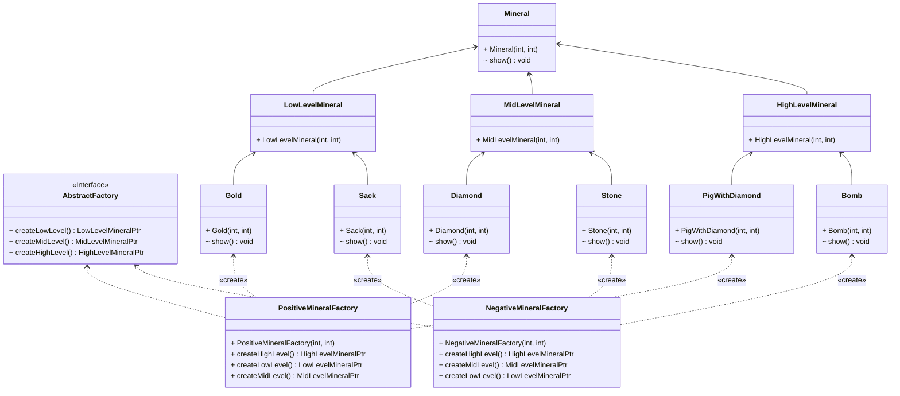

```mermaid
classDiagram
direction BT
class AbstractFactory {
<<Interface>>
  + createLowLevel() LowLevelMineralPtr
  + createMidLevel() MidLevelMineralPtr
  + createHighLevel() HighLevelMineralPtr
}
class Bomb {
  + Bomb(int, int) 
  ~ show() void
}
class Diamond {
  + Diamond(int, int) 
  ~ show() void
}
class Gold {
  + Gold(int, int) 
  ~ show() void
}
class HighLevelMineral {
  + HighLevelMineral(int, int) 
}
class LowLevelMineral {
  + LowLevelMineral(int, int) 
}
class MidLevelMineral {
  + MidLevelMineral(int, int) 
}
class Mineral {
  + Mineral(int, int) 
  ~ show() void
}
class NegativeMineralFactory {
  + NegativeMineralFactory(int, int) 
  + createHighLevel() HighLevelMineralPtr
  + createMidLevel() MidLevelMineralPtr
  + createLowLevel() LowLevelMineralPtr
}
class PigWithDiamond {
  + PigWithDiamond(int, int) 
  ~ show() void
}
class PositiveMineralFactory {
  + PositiveMineralFactory(int, int) 
  + createHighLevel() HighLevelMineralPtr
  + createLowLevel() LowLevelMineralPtr
  + createMidLevel() MidLevelMineralPtr
}
class Sack {
  + Sack(int, int) 
  ~ show() void
}
class Stone {
  + Stone(int, int) 
  ~ show() void
}

LowLevelMineral  -->  Mineral
MidLevelMineral  -->  Mineral
HighLevelMineral  -->  Mineral
Gold  -->  LowLevelMineral
Sack  -->  LowLevelMineral
Diamond  -->  MidLevelMineral
Stone  -->  MidLevelMineral
PigWithDiamond  -->  HighLevelMineral
Bomb  -->  HighLevelMineral 
PositiveMineralFactory  ..>  AbstractFactory
NegativeMineralFactory  ..>  AbstractFactory
PositiveMineralFactory  ..>  Gold : «create»
PositiveMineralFactory  ..>  Diamond : «create»
PositiveMineralFactory  ..>  PigWithDiamond : «create»
NegativeMineralFactory  ..>  Sack : «create»
NegativeMineralFactory  ..>  Stone : «create»
NegativeMineralFactory  ..>  Bomb : «create»
```

