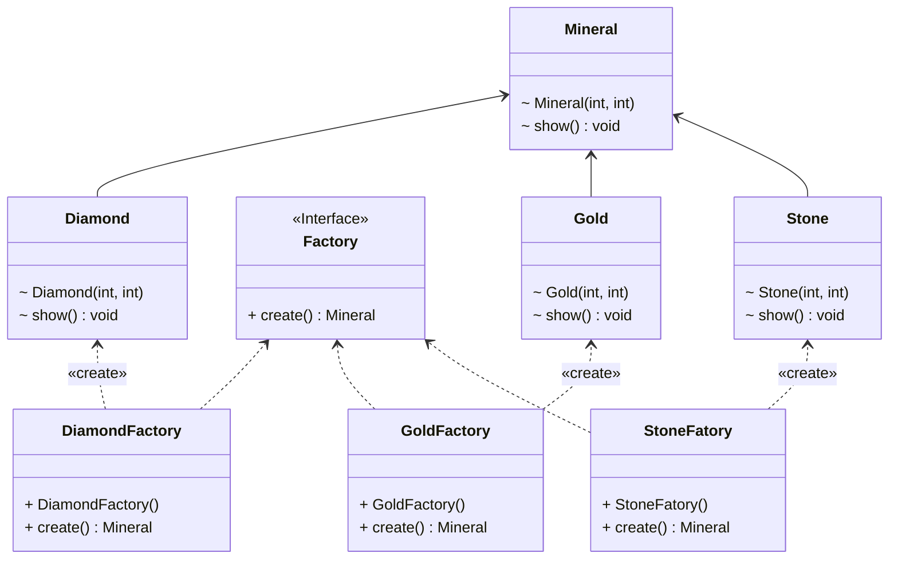

```mermaid
classDiagram
direction BT
class Diamond {
  ~ Diamond(int, int) 
  ~ show() void
}
class DiamondFactory {

  + DiamondFactory() 
  + create() Mineral
    }
    class Factory {
    <<Interface>>
  + create() Mineral
    }
    class Gold {
      ~ Gold(int, int) 
      ~ show() void
    }
    class GoldFactory {
  + GoldFactory() 
  + create() Mineral
    }
    class Mineral {
      ~ Mineral(int, int) 
      ~ show() void
    }
    class Stone {
      ~ Stone(int, int) 
      ~ show() void
    }
    class StoneFatory {
  + StoneFatory() 
  + create() Mineral
    }

Diamond  -->  Mineral 
DiamondFactory  ..>  Diamond : «create»
DiamondFactory  ..>  Factory 
Gold  -->  Mineral 
GoldFactory  ..>  Factory 
GoldFactory  ..>  Gold : «create»
Stone  -->  Mineral 
StoneFatory  ..>  Factory 
StoneFatory  ..>  Stone : «create»
```

