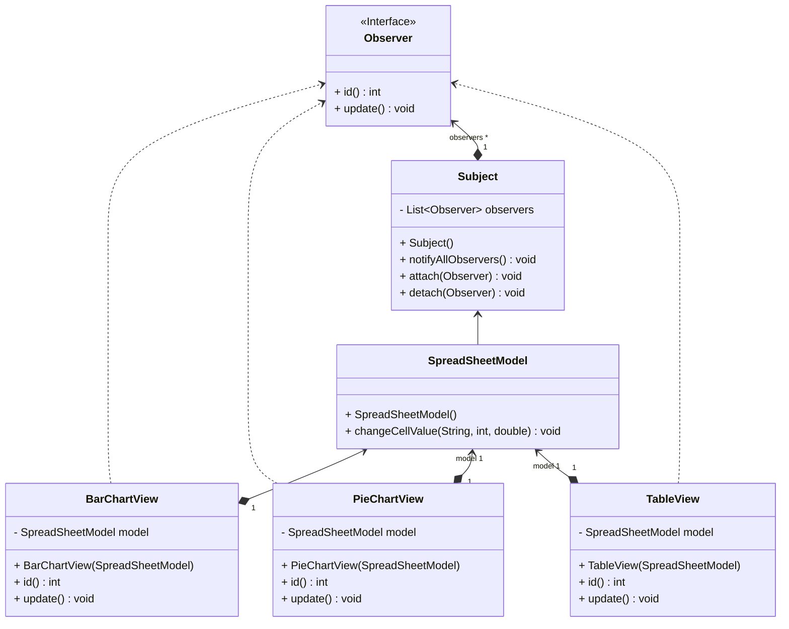

```mermaid
classDiagram
direction BT
class BarChartView {
  + BarChartView(SpreadSheetModel) 
  - SpreadSheetModel model
  + id() int
  + update() void
}
class Observer {
<<Interface>>
  + id() int
  + update() void
}
class PieChartView {
  + PieChartView(SpreadSheetModel) 
  - SpreadSheetModel model
  + id() int
  + update() void
}
class SpreadSheetModel {
  + SpreadSheetModel() 
  + changeCellValue(String, int, double) void
}
class Subject {
  + Subject() 
  - List~Observer~ observers
  + notifyAllObservers() void
  + attach(Observer) void
  + detach(Observer) void
}
class TableView {
  + TableView(SpreadSheetModel) 
  - SpreadSheetModel model
  + id() int
  + update() void
}

BarChartView  ..>  Observer 
BarChartView "1" *--> "model 1" SpreadSheetModel 
PieChartView  ..>  Observer 
PieChartView "1" *--> "model 1" SpreadSheetModel 
SpreadSheetModel  -->  Subject 
Subject "1" *--> "observers *" Observer 
TableView  ..>  Observer 
TableView "1" *--> "model 1" SpreadSheetModel 

```

