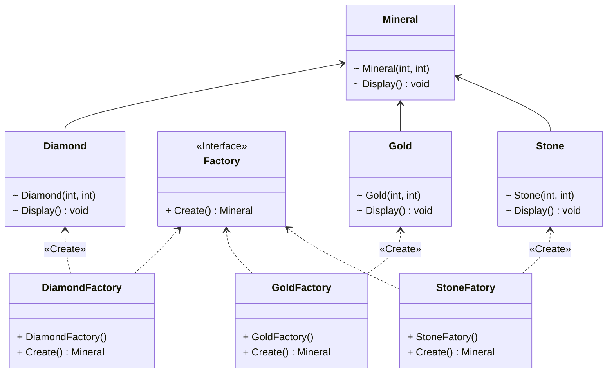

```mermaid
classDiagram
direction BT
class Diamond {
  ~ Diamond(int, int)
  ~ Display() void
}
class DiamondFactory {

  + DiamondFactory()
  + Create() Mineral
    }
    class Factory {
    <<Interface>>
  + Create() Mineral
    }
    class Gold {
      ~ Gold(int, int)
      ~ Display() void
    }
    class GoldFactory {
  + GoldFactory()
  + Create() Mineral
    }
    class Mineral {
      ~ Mineral(int, int)
      ~ Display() void
    }
    class Stone {
      ~ Stone(int, int)
      ~ Display() void
    }
    class StoneFatory {
  + StoneFatory()
  + Create() Mineral
    }

Diamond  -->  Mineral
DiamondFactory  ..>  Diamond : «Create»
DiamondFactory  ..>  Factory
Gold  -->  Mineral
GoldFactory  ..>  Factory
GoldFactory  ..>  Gold : «Create»
Stone  -->  Mineral
StoneFatory  ..>  Factory
StoneFatory  ..>  Stone : «Create»
```

