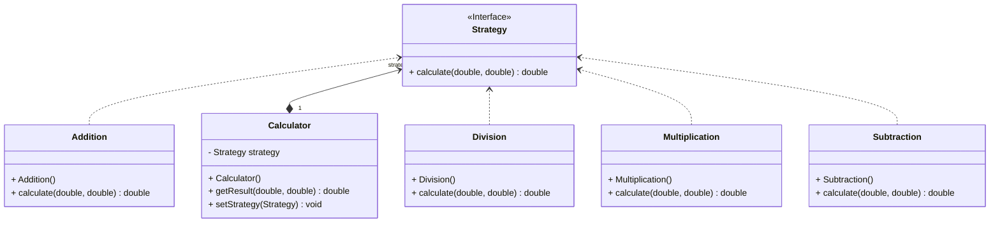

```mermaid
classDiagram
direction BT
class Addition {
  + Addition()
  + calculate(double, double) double
}
class Calculator {
  + Calculator()
  - Strategy strategy
  + getResult(double, double) double
  + setStrategy(Strategy) void
}
class Division {
  + Division()
  + calculate(double, double) double
}
class Multiplication {
  + Multiplication()
  + calculate(double, double) double
}
class Strategy {
<<Interface>>
  + calculate(double, double) double
}
class Subtraction {
  + Subtraction()
  + calculate(double, double) double
}

Addition  ..>  Strategy
Calculator "1" *--> "strategy 1" Strategy
Division  ..>  Strategy
Multiplication  ..>  Strategy
Subtraction  ..>  Strategy

```

